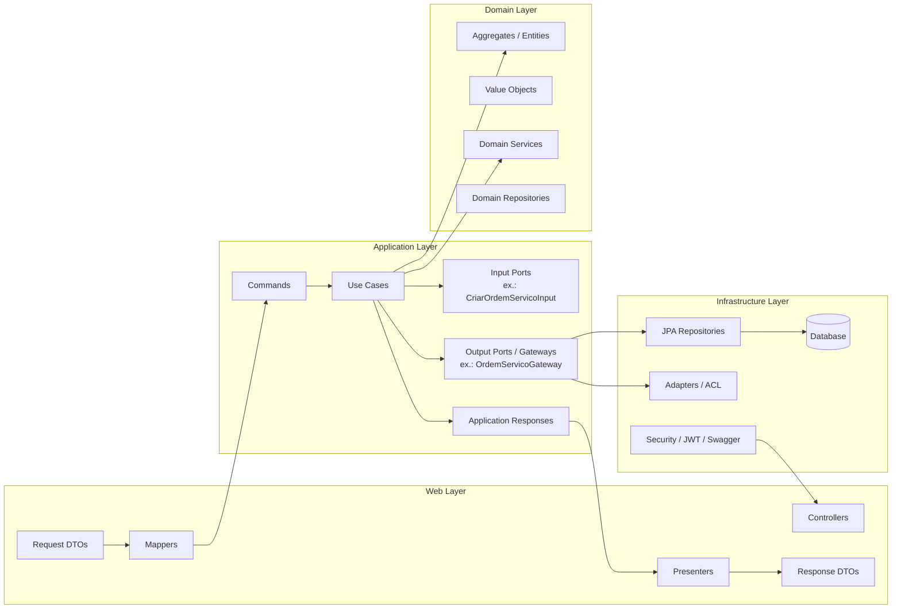

# Arquitetura do Projeto (Clean Architecture & DDD)

Este documento detalha a estrutura de arquitetura adotada no **Sistema de Gestão de Oficina**, fundamentada nos princípios de **Clean Architecture** (Arquitetura Limpa) e **Domain-Driven Design (DDD)**.

---

## 🏗️ Princípios Gerais

A arquitetura do sistema foi projetada com foco na separação de preocupações, testabilidade e independência de frameworks externos ou banco de dados.

### Direção das Dependências

As dependências de código apontam estritamente para o centro (para o Domínio). As camadas externas dependem das internas, mas as internas desconhecem totalmente as externas.

```
Web Layer ──> Application Layer ──> Domain Layer <── Infrastructure Layer
```

- **Domain Layer (Domínio):** O núcleo da aplicação. Não possui dependências de nenhuma outra camada ou de bibliotecas externas (exceto anotações essenciais).
- **Application Layer (Aplicação):** Contém os casos de uso que orquestram as regras de negócio de domínio. Depende apenas do Domínio.
- **Infrastructure Layer (Infraestrutura):** Contém detalhes técnicos como acesso a banco de dados (JPA/Hibernate), configuração de mensageria, etc. Implementa as portas (interfaces) definidas no Domínio e Aplicação.
- **Web Layer (REST API):** Expeõe os endpoints HTTP e DTOs, comunicando-se diretamente com a Camada de Aplicação.

---

## 📂 Estrutura de Pacotes (Package Tree)

O projeto está organizado em **Bounded Contexts** (Contextos Delimitados), garantindo limites claros de responsabilidades para cada área de negócio:

```
com.techchallenge.oficina/
├── administrativo/                         # Bounded Context Administrativo
│   ├── application/                        # Camada de Aplicação
│   │   └── usecases/
│   │       ├── commands/                   # Comandos de entrada para os casos de uso
│   │       ├── ports/
│   │       │   ├── input/                  # Input Ports (contratos dos use cases)
│   │       │   └── output/                 # Output Ports / Gateways
│   │       └── responses/                  # Respostas normalizadas da aplicação
│   ├── domain/                             # Camada de Domínio
│   │   ├── events/
│   │   ├── exceptions/
│   │   ├── model/
│   │   ├── repositories/                   # Contracts de persistência (portas do domínio)
│   │   └── services/
│   ├── infrastructure/
│   │   ├── config/
│   │   ├── gateways/
│   │   └── persistence/
│   └── web/
│       ├── controllers/
│       ├── dto/
│       ├── mappers/
│       └── presenters/
├── os/                                     # Bounded Context de Ordem de Serviço
│   ├── application/
│   │   └── usecases/
│   │       ├── commands/
│   │       ├── ports/
│   │       │   ├── input/
│   │       │   └── output/
│   │       └── responses/
│   ├── domain/
│   │   ├── events/
│   │   ├── exceptions/
│   │   ├── model/
│   │   ├── repositories/
│   │   └── services/
│   ├── infrastructure/
│   │   ├── acl/
│   │   ├── config/
│   │   └── persistence/
│   └── web/
│       ├── controllers/
│       ├── dto/
│       ├── mappers/
│       └── presenters/
├── sharedkernel/                           # Kernel Compartilhado
│   ├── application/
│   │   └── ports/
│   ├── common/
│   ├── domain/
│   ├── infrastructure/
│   │   └── security/
│   └── web/
└── infrastructure/config/                  # Configurações globais do Spring Boot
    ├── security/
    └── swagger/
```

---

## 🔄 Fluxo de Dependência Atual



> Observação: a camada de aplicação não depende da implementação de persistência; ela depende apenas dos contratos definidos em `ports.input` e `ports.output`.

---

## 🎯 Camadas da Arquitetura

### 1. Domain Layer (Domínio)
É onde residem as regras de negócio essenciais e os modelos de dados.
- **Aggregates & Entities:** Objetos com identidade própria que agrupam comportamentos e mantêm consistência transacional (ex: `OrdemServico`, `Cliente`).
- **Value Objects:** Objetos sem identidade própria definidos apenas por seus atributos (ex: `CPF`, `Placa`, `Email`).
- **Domain Services:** Lógicas de negócio que envolvem mais de um Aggregate ou que não se encaixam perfeitamente em uma única Entidade.
- **Domain Events:** Eventos que sinalizam mudanças de estado importantes no negócio.
- **Repositories (Interfaces):** Definição dos contratos de persistência (Portas) que a infraestrutura deve implementar.

### 2. Application Layer (Aplicação)
Responsável por coordenar a execução das regras de negócio.
- **Use Cases:** Classes que executam fluxos de negócio específicos (ex: `CriarOrdemServicoUseCase`, `ValidarOrcamentoUseCase`).
- **Input Ports:** Interfaces que definem o contrato de entrada dos casos de uso, permitindo que a camada web ou o orchestrator chame a aplicação sem acoplamento direto à implementação.
- **Output Ports / Gateways:** Interfaces que abstraem dependências externas da aplicação, como persistência, integrações e acesso a outros contextos.
- **Command / Response:** Estruturas de dados que representam a intenção de alteração (Command) e as respostas normalizadas retornadas pelos casos de uso.

### 3. Infrastructure Layer (Infraestrutura)
Implementa os detalhes técnicos e as integrações externas necessários para a execução do sistema.
- **Repositories (Implementações):** Classes JPA/Hibernate que implementam as interfaces de persistência do domínio e os `output ports` da aplicação, conectando o código de negócio ao banco de dados.
- **Gateways / Adapters:** Adaptadores para APIs externas, ACLs entre bounded contexts e integrações específicas, como acesso a dados de outros contextos.
- **Database Migrations:** Scripts do Flyway para controle de versão do banco de dados MySQL/PostgreSQL.

### 4. Web Layer (Apresentação REST)
A porta de entrada HTTP para o sistema.
- **Controllers:** Controllers REST do Spring Boot que interceptam as requisições HTTP, executam validações simples e invocam os Use Cases.
- **DTOs:** Objetos simples que expõem os dados da API de forma controlada, sem expor as entidades de domínio diretamente.
- **Mappers:** Classes que convertem DTOs em objetos de comando da aplicação e vice-versa.
- **Presenters:** Componentes da camada web que recebem as respostas da aplicação e as transformam em um `view model` HTTP final, preparando o payload que será devolvido ao cliente.
- **Presenters:** Componentes da web que recebem as `responses` da aplicação e as adaptam para o formato de saída HTTP, preparando o `view model` que será devolvido ao cliente.

---

## 🧩 Bounded Contexts (Contextos Delimitados)

- **Administrativo:** Responsável por toda a gestão cadastral básica do sistema (CRUD de Clientes, CRUD de Veículos, CRUD de Serviços, CRUD de Peças e Insumos com controle de estoque).
- **Ordem de Serviço (OS):** Core business da aplicação. Controla o fluxo de trabalho desde a recepção do veículo, diagnóstico do mecânico, envio do orçamento para o cliente, aprovação de reparos, execução e entrega final.
- **Shared Kernel:** Contém utilitários, exceções genéricas, filtros de segurança JWT e estruturas de autenticação que precisam ser compartilhados entre todos os outros contextos.

---

## 📚 Decisões Arquiteturais Registradas (ADRs)

Para compreender o histórico de decisões e escolhas técnicas da equipe, consulte o arquivo detalhado de **Architectural Decision Records (ADRs)**:

- [Guia de ADRs (Architecture Decision Records)](adr.md)
  - **ADR-001:** Adoção de Clean Architecture com Bounded Contexts.
  - **ADR-012:** Implementação do JaCoCo para cobertura de testes automatizados.
  - **ADR-014:** Adoção do Swagger/SpringDoc para documentação interativa de API.
