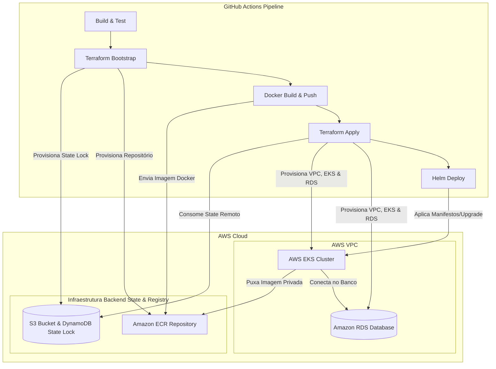

# Fluxo de CI/CD (Integração e Entrega Contínuas)

Esta documentação descreve o funcionamento e a arquitetura da pipeline de CI/CD configurada para o projeto **Sistema de Gestão de Oficina**, utilizando GitHub Actions, Terraform e Helm para provisionar e implantar a aplicação na AWS.

---

## 🏗️ Arquitetura do Deployment

O deploy da aplicação é realizado em um cluster **AWS EKS (Elastic Kubernetes Service)** provisionado via **Terraform**, com o empacotamento e a implantação gerenciados pelo **Helm**. A imagem Docker é gerada e armazenada no **Amazon ECR (Elastic Container Registry)**. O state file do Terraform é armazenado no **Amazon S3** com controle de concorrência feito via **DynamoDB**.

Abaixo está a representação visual do relacionamento entre a pipeline e os recursos na AWS:



---

## 🚀 Pipeline de CI/CD (GitHub Actions)

A pipeline está declarada em [../.github/workflows/pipeline.yml](https://www.google.com/search?q=../.github/workflows/pipeline.yml) e é disparada nas seguintes condições:

* **Push** na branch `main`.
* **Pull Request** direcionado às branches `main` ou `develop`.

> [!NOTE]
> Para Pull Requests, apenas o primeiro Job (`Build & Test`) é executado. O provisionamento de infraestrutura e o deploy em produção são limitados a merges ocorridos na branch `main`.

### 📋 Detalhamento dos Jobs


#### 1. Build & Test

* **Descrição:** Compila o código fonte em Java 21 e roda toda a suíte de testes.
* **Passos:**
* Configuração do JDK 21 (Corretto).
* Execução do Maven: `mvn clean verify` no diretório `/oficina`.
* Salvamento do arquivo `.jar` gerado como um artefato temporário do GitHub Actions (`application-jar`) para ser reutilizado nos passos seguintes.


#### 2. Bootstrap Terraform Backend

* **Descrição:** Garante a existência do bucket S3 e da tabela DynamoDB necessários para persistir e travar o state remoto do Terraform, além do repositório no Amazon ECR.
* **Passos:**
* Configuração das credenciais da AWS.
* Verifica a existência do bucket `bucket-tfstate-1029`.
* Caso não exista, executa o `terraform init` e `terraform apply` na pasta `terraform/bootstrap` para provisionar o bucket S3, a tabela de controle de lock no DynamoDB (`meu-terraform-state-lock`) e o repositório ECR (`oficina-api`).


#### 3. Build & Push Docker Image

* **Descrição:** Cria a imagem Docker da aplicação empacotando o `.jar` construído anteriormente.
* **Passos:**
* Login no Amazon ECR.
* Download do artefato do JAR gerado no primeiro Job.
* Build da imagem Docker usando o [../oficina/Dockerfile](https://www.google.com/search?q=../oficina/Dockerfile).
* Envio da imagem para o repositório ECR (`oficina-api`) tagueada com o SHA curto do commit (`SHORT_SHA`) e a tag `latest`.


#### 4. Terraform Plan

* **Descrição:** Planeja as alterações de infraestrutura na AWS (VPC, RDS, EKS).
* **Passos:**
* Inicialização do Terraform apontando para o backend remoto configurado no S3.
* Geração do plano de execução do Terraform (`terraform plan`) injetando variáveis de ambiente confidenciais (ex: `db_username`).
* Salvamento do plano gerado como artefato (`tfplan`).


#### 5. Terraform Apply

* **Descrição:** Aplica as mudanças planejadas no Terraform para criar/atualizar a infraestrutura da AWS.
* **Passos:**
* Aplicação do plano de infraestrutura (`terraform apply tfplan`) para provisionamento da VPC, banco de dados RDS (MySQL/PostgreSQL) e cluster AWS EKS (`oficina-cluster`).
* Exportação do endpoint do RDS para ser consumido nas variáveis do Helm.


#### 6. Deploy Helm -> EKS

* **Descrição:** Atualiza a aplicação e suas configurações no cluster Kubernetes.
* **Passos:**
* Configuração do contexto local do Kubernetes (`kubectl`) apontando para o EKS Cluster.
* Recuperação da senha mestre do RDS criada no AWS Secrets Manager.
* Criação ou atualização do segredo do tipo `docker-registry` (`aws-ecr-secret`) no Kubernetes para permitir que o cluster baixe a imagem privada do ECR.
* Execução de `helm upgrade --install` utilizando o chart contido em [../k8s/oficina](https://www.google.com/search?q=../k8s/oficina).
* Validação do rollout do deployment da API (`oficina-api`) garantindo que a nova versão está saudável e em execução.


---

## 🔍 Como Localizar e Acessar a Aplicação pós-Deploy

Uma vez que a pipeline conclua o Job de Deploy com sucesso, a aplicação estará publicada. Como a infraestrutura de produção desabilita o Ingress e utiliza a exposição via **LoadBalancer** diretamente no Service (`type: LoadBalancer`), um balanceador de carga físico (CLB ou NLB) é criado na AWS.

Siga os passos abaixo na sua máquina local para encontrar a URL de acesso externa.

### 📋 Requisitos Mínimos Locais

Para interagir com o cluster e validar as URLs, você precisa ter instalado:

1. **AWS CLI (v2)**.
2. **kubectl** (Componente de linha de comando do Kubernetes).
3. **Um cliente HTTP/Navegador** (Chrome, Postman, cURL, etc.).

### 🛠️ Passo a Passo para Descoberta da URL

#### 1. Configurar Credenciais Locais da AWS

Caso ainda não tenha feito, configure a CLI da AWS com as credenciais que possuem acesso ao cluster:

```bash
aws configure

```

*Se estiver em ambientes como o AWS Academy, lembre-se de exportar o seu `AWS_SESSION_TOKEN` no terminal antes de prosseguir.*

#### 2. Conectar e Atualizar o Contexto do Cluster EKS

Execute o comando abaixo para configurar o seu `kubectl` local para apontar e ditar comandos ao cluster do projeto:

```bash
aws eks update-kubeconfig --name oficina-cluster --region us-east-1

```

#### 3. Buscar o Endereço Externo (External IP) do Service

Rode o comando abaixo para listar os serviços ativos mapeados no namespace do deploy:

```bash
kubectl get service -n default

```

*Procure pelo serviço chamado `oficina-api`. Na coluna **`EXTERNAL-IP`**, você verá uma URL pública longa gerada pela AWS, similar a:*

`a1234567890abcdef1234567890abcdef-123456789.us-east-1.elb.amazonaws.com`

#### 4. Montar as URLs do Actuator e Swagger

O Service mapeia a porta **80** externa para a **8080** interna da aplicação. Como a porta 80 é o padrão HTTP, não é necessário digitar portas na URL. Copie o endereço obtido no passo anterior (`EXTERNAL-IP`) e monte suas requisições:

* **Swagger UI (Documentação da API):**
```text
http://<URL_DO_EXTERNAL_IP>/swagger-ui/index.html

```


* **Actuator Health (Status geral da API):**
```text
http://<URL_DO_EXTERNAL_IP>/actuator/health

```


* **Probes de Ciclo de Vida do Kubernetes:**
```text
http://<URL_DO_EXTERNAL_IP>/actuator/health/liveness
http://<URL_DO_EXTERNAL_IP>/actuator/health/readiness

```


> [!TIP]
> **Tempo de Espera:** A AWS leva de 2 a 3 minutos para provisionar e ativar o LoadBalancer físico após o comando do Kubernetes. Se receber um erro de "Conexão Recusada" de imediato, aguarde um momento e tente novamente.

---

## 🔐 Configuração de Secrets no GitHub

Para que a pipeline execute com sucesso na sua conta AWS, você deve cadastrar as seguintes variáveis sensíveis em **Settings -> Secrets and variables -> Actions** no repositório do GitHub:

| Secret | Descrição |
| --- | --- |
| `AWS_ACCESS_KEY_ID` | ID da chave de acesso da AWS. |
| `AWS_SECRET_ACCESS_KEY` | Chave de acesso secreta da AWS. |
| `AWS_SESSION_TOKEN` | Token de sessão temporária da AWS  |
| `DB_USERNAME` | Nome do usuário root para o banco de dados RDS. |
| `JWT_SECRET` | Chave secreta de criptografia para os tokens JWT do Spring Security. |
| `SECURITY_USER_NAME` | Nome de usuário administrativo padrão da API. |
| `SECURITY_USER_PASSWORD` | Senha do usuário administrativo padrão da API. |

---

## ⚙️ Variáveis de Ambiente da Aplicação no EKS

Durante o deployment via Helm, as seguintes variáveis de ambiente são passadas para o container da aplicação e mapeadas nas configurações do Spring Boot:

* `SPRING_DATASOURCE_URL`: String de conexão JDBC gerada dinamicamente apontando para o endpoint do RDS MySQL criado pelo Terraform (`jdbc:mysql://[RDS_ENDPOINT]:3306/oficina`).
* `SPRING_DATASOURCE_USERNAME`: Nome do usuário administrador extraído do secret `DB_USERNAME`.
* `SPRING_DATASOURCE_PASSWORD`: Senha do RDS recuperada de forma segura do AWS Secrets Manager.
* `JWT_SECRET`: Chave secreta de autenticação extraída dos secrets do GitHub.
* `SECURITY_USER_NAME` e `SECURITY_USER_PASSWORD`: Credenciais para autenticação administrativa padrão da API.
